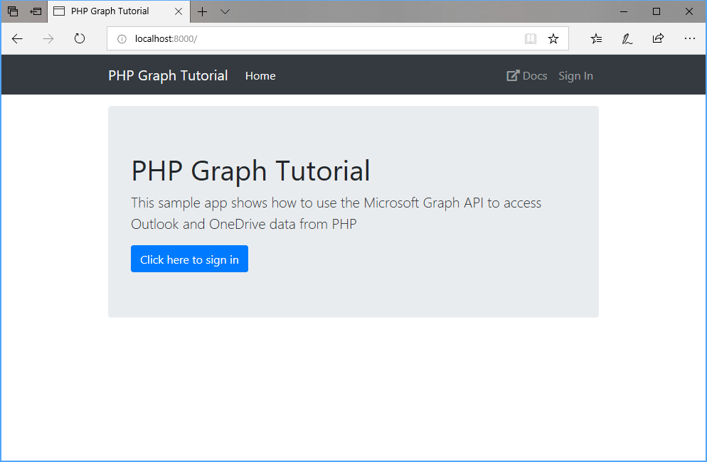

<!-- markdownlint-disable MD002 MD041 -->

Para empezar, cree un nuevo proyecto Laravel.

1. Abra la interfaz de línea de comandos (CLI), vaya a un directorio donde tenga derechos para crear archivos y ejecute el siguiente comando para crear una nueva aplicación PHP.

    ```Shell
    laravel new graph-tutorial
    ```

1. Navegue hasta el directorio **gráfico-tutorial** y escriba el siguiente comando para iniciar un servidor Web local.

    ```Shell
    php artisan serve
    ```

1. Abra el explorador y vaya a `http://localhost:8000`. Si todo funciona, verá una página predeterminada de Laravel. Si no ve esa página, compruebe los [documentos de Laravel](https://laravel.com/docs/7.x).

## <a name="install-packages"></a>Instalar paquetes

Antes de continuar, instale algunos paquetes adicionales que usará más adelante:

- [OAuth2-Client](https://github.com/thephpleague/oauth2-client) para controlar los flujos de tokens de inicio de sesión y OAuth.
- [Microsoft-Graph](https://github.com/microsoftgraph/msgraph-sdk-php) para realizar llamadas a Microsoft Graph.

1. Ejecute el siguiente comando para quitar la versión existente de `guzzlehttp/guzzle` . La versión instalada por Laravel entra en conflicto con la versión requerida por el SDK PHP de Microsoft Graph.

    ```Shell
    composer remove guzzlehttp/guzzle
    ```

1. Ejecute el siguiente comando en su CLI.

    ```Shell
    composer require league/oauth2-client microsoft/microsoft-graph
    ```

## <a name="design-the-app"></a>Diseñar la aplicación

1. Cree un nuevo archivo en el directorio **./Resources/views** denominado `layout.blade.php` y agregue el siguiente código.

    :::code language="php" source="../demo/graph-tutorial/resources/views/layout.blade.php" id="LayoutSnippet":::

    Este código agrega un [bootstrap](http://getbootstrap.com/) para los estilos sencillos y la [fuente maravilla](https://fontawesome.com/) para algunos iconos simples. También define un diseño global con una barra de navegación.

1. Cree un nuevo directorio en el `./public` directorio denominado `css` y, a continuación, cree un nuevo archivo en el `./public/css` directorio denominado `app.css` . Agregue el siguiente código.

    :::code language="css" source="../demo/graph-tutorial/public/css/app.css":::

1. Abra el `./resources/views/welcome.blade.php` archivo y reemplace el contenido por lo siguiente.

    :::code language="php" source="../demo/graph-tutorial/resources/views/welcome.blade.php" id="WelcomeSnippet":::

1. Actualice la `Controller` clase base en **./app/http/Controllers/Controller.php** agregando la siguiente función a la clase.

    :::code language="php" source="../demo/graph-tutorial/app/Http/Controllers/Controller.php" id="LoadViewDataSnippet":::

1. Cree un nuevo archivo en el `./app/Http/Controllers` directorio denominado `HomeController.php` y agregue el siguiente código.

    :::code language="php" source="../demo/graph-tutorial/app/Http/Controllers/HomeController.php":::

1. Actualice la ruta en `./routes/web.php` para usar el nuevo controlador. Reemplace todo el contenido de este archivo por lo siguiente.

    ```php
    <?php

    use Illuminate\Support\Facades\Route;

    Route::get('/', 'HomeController@welcome');
    ```

1. Guarde todos los cambios y reinicie el servidor. Ahora, la aplicación debe tener un aspecto muy diferente.

    
