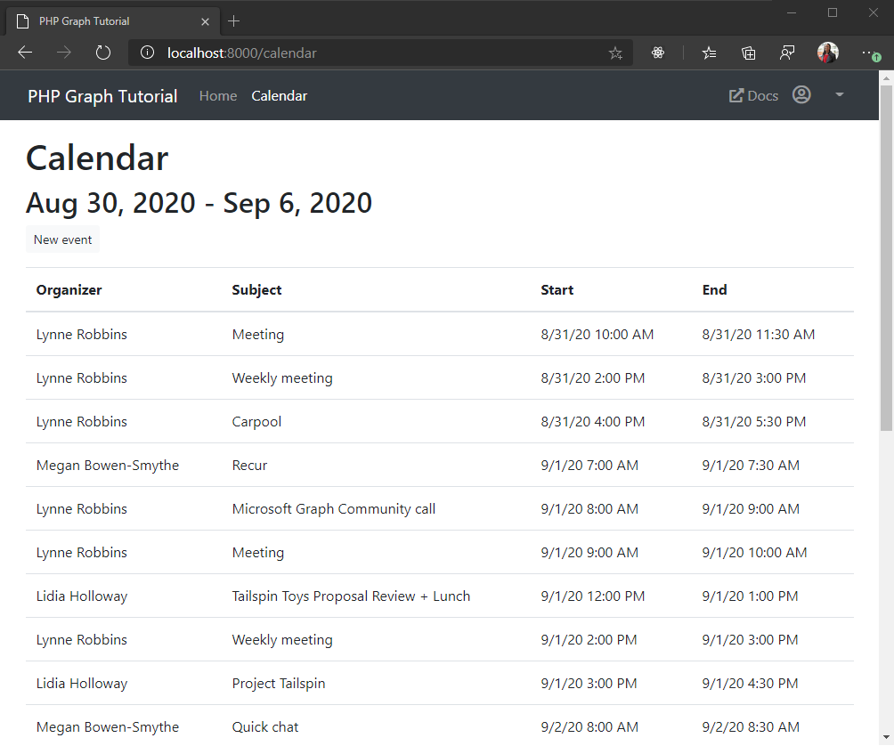

<!-- markdownlint-disable MD002 MD041 -->

<span data-ttu-id="d81e8-101">En este ejercicio, incorporará Microsoft Graph a la aplicación.</span><span class="sxs-lookup"><span data-stu-id="d81e8-101">In this exercise you will incorporate the Microsoft Graph into the application.</span></span> <span data-ttu-id="d81e8-102">Para esta aplicación, usará la biblioteca [de Microsoft-Graph](https://github.com/microsoftgraph/msgraph-sdk-php) para realizar llamadas a Microsoft Graph.</span><span class="sxs-lookup"><span data-stu-id="d81e8-102">For this application, you will use the [microsoft-graph](https://github.com/microsoftgraph/msgraph-sdk-php) library to make calls to Microsoft Graph.</span></span>

## <a name="get-calendar-events-from-outlook"></a><span data-ttu-id="d81e8-103">Obtener eventos de calendario de Outlook</span><span class="sxs-lookup"><span data-stu-id="d81e8-103">Get calendar events from Outlook</span></span>

1. <span data-ttu-id="d81e8-104">Cree un nuevo archivo en el directorio **./app/http/Controllers** denominado `CalendarController.php`y agregue el siguiente código.</span><span class="sxs-lookup"><span data-stu-id="d81e8-104">Create a new file in the **./app/Http/Controllers** directory named `CalendarController.php`, and add the following code.</span></span>

    ```php
    <?php

    namespace App\Http\Controllers;

    use App\Http\Controllers\Controller;
    use Illuminate\Http\Request;
    use Microsoft\Graph\Graph;
    use Microsoft\Graph\Model;
    use App\TokenStore\TokenCache;

    class CalendarController extends Controller
    {
      public function calendar()
      {
        $viewData = $this->loadViewData();

        // Get the access token from the cache
        $tokenCache = new TokenCache();
        $accessToken = $tokenCache->getAccessToken();

        // Create a Graph client
        $graph = new Graph();
        $graph->setAccessToken($accessToken);

        $queryParams = array(
          '$select' => 'subject,organizer,start,end',
          '$orderby' => 'createdDateTime DESC'
        );

        // Append query parameters to the '/me/events' url
        $getEventsUrl = '/me/events?'.http_build_query($queryParams);

        $events = $graph->createRequest('GET', $getEventsUrl)
          ->setReturnType(Model\Event::class)
          ->execute();

        return response()->json($events);
      }
    }
    ```

    <span data-ttu-id="d81e8-105">Tenga en cuenta lo que está haciendo este código.</span><span class="sxs-lookup"><span data-stu-id="d81e8-105">Consider what this code is doing.</span></span>

    - <span data-ttu-id="d81e8-106">La dirección URL a la que se `/v1.0/me/events`llamará es.</span><span class="sxs-lookup"><span data-stu-id="d81e8-106">The URL that will be called is `/v1.0/me/events`.</span></span>
    - <span data-ttu-id="d81e8-107">El `$select` parámetro limita los campos devueltos para cada evento a solo aquellos que la vista usará realmente.</span><span class="sxs-lookup"><span data-stu-id="d81e8-107">The `$select` parameter limits the fields returned for each events to just those the view will actually use.</span></span>
    - <span data-ttu-id="d81e8-108">El `$orderby` parámetro ordena los resultados por la fecha y hora en que se crearon, con el elemento más reciente en primer lugar.</span><span class="sxs-lookup"><span data-stu-id="d81e8-108">The `$orderby` parameter sorts the results by the date and time they were created, with the most recent item being first.</span></span>

1. <span data-ttu-id="d81e8-109">Actualice las rutas en **./Routes/Web.php** para agregar una ruta a este nuevo controlador.</span><span class="sxs-lookup"><span data-stu-id="d81e8-109">Update the routes in **./routes/web.php** to add a route to this new controller.</span></span>

    ```php
    Route::get('/calendar', 'CalendarController@calendar');
    ```

1. <span data-ttu-id="d81e8-110">Inicie sesión y haga clic en el vínculo de **calendario** en la barra de navegación.</span><span class="sxs-lookup"><span data-stu-id="d81e8-110">Sign in and click the **Calendar** link in the nav bar.</span></span> <span data-ttu-id="d81e8-111">Si todo funciona, debería ver un volcado JSON de eventos en el calendario del usuario.</span><span class="sxs-lookup"><span data-stu-id="d81e8-111">If everything works, you should see a JSON dump of events on the user's calendar.</span></span>

## <a name="display-the-results"></a><span data-ttu-id="d81e8-112">Mostrar los resultados</span><span class="sxs-lookup"><span data-stu-id="d81e8-112">Display the results</span></span>

<span data-ttu-id="d81e8-113">Ahora puede Agregar una vista para mostrar los resultados de forma más fácil de uso.</span><span class="sxs-lookup"><span data-stu-id="d81e8-113">Now you can add a view to display the results in a more user-friendly manner.</span></span>

1. <span data-ttu-id="d81e8-114">Cree un nuevo archivo en el directorio **./Resources/views** denominado `calendar.blade.php` y agregue el siguiente código.</span><span class="sxs-lookup"><span data-stu-id="d81e8-114">Create a new file in the **./resources/views** directory named `calendar.blade.php` and add the following code.</span></span>

    :::code language="php" source="../demo/graph-tutorial/resources/views/calendar.blade.php" id="CalendarSnippet":::

    <span data-ttu-id="d81e8-115">Se recorrerá en bucle una colección de eventos y se agregará una fila de tabla para cada uno.</span><span class="sxs-lookup"><span data-stu-id="d81e8-115">That will loop through a collection of events and add a table row for each one.</span></span>

1. <span data-ttu-id="d81e8-116">Quite la `return response()->json($events);` línea de la `calendar` acción en **./app/http/Controllers/CalendarController.php**y reemplácela por el código siguiente.</span><span class="sxs-lookup"><span data-stu-id="d81e8-116">Remove the `return response()->json($events);` line from the `calendar` action in **./app/Http/Controllers/CalendarController.php**, and replace it with the following code.</span></span>

    ```php
    $viewData['events'] = $events;
    return view('calendar', $viewData);
    ```

1. <span data-ttu-id="d81e8-117">Actualice la página y la aplicación ahora debería representar una tabla de eventos.</span><span class="sxs-lookup"><span data-stu-id="d81e8-117">Refresh the page and the app should now render a table of events.</span></span>

    
