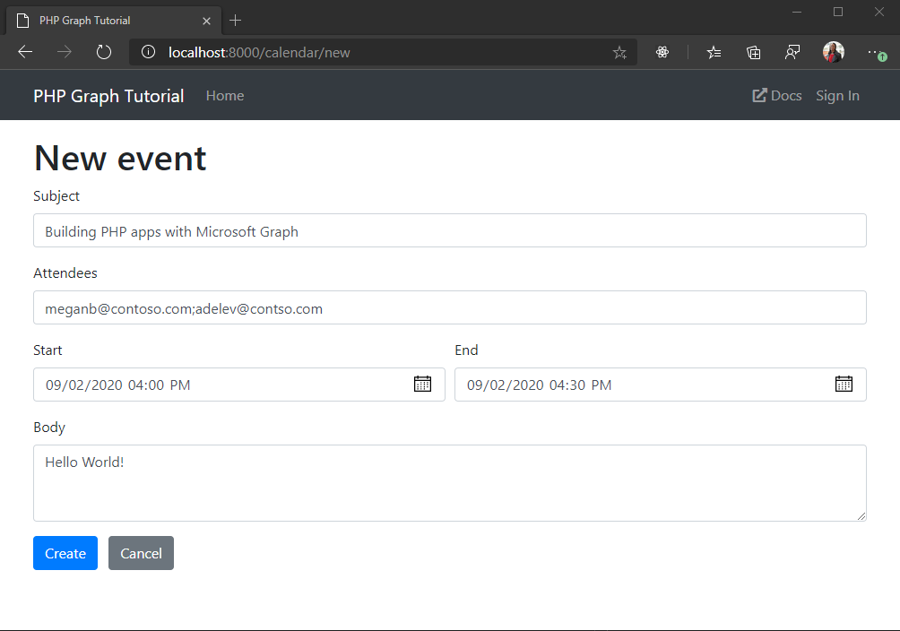

<!-- markdownlint-disable MD002 MD041 -->

<span data-ttu-id="94b6f-101">En esta sección, agregará la capacidad de crear eventos en el calendario del usuario.</span><span class="sxs-lookup"><span data-stu-id="94b6f-101">In this section you will add the ability to create events on the user's calendar.</span></span>

## <a name="create-new-event-form"></a><span data-ttu-id="94b6f-102">Crear nuevo formulario de eventos</span><span class="sxs-lookup"><span data-stu-id="94b6f-102">Create new event form</span></span>

1. <span data-ttu-id="94b6f-103">Cree un nuevo archivo en el directorio **./Resources/views** denominado `newevent.blade.php` y agregue el siguiente código.</span><span class="sxs-lookup"><span data-stu-id="94b6f-103">Create a new file in the **./resources/views** directory named `newevent.blade.php` and add the following code.</span></span>

    :::code language="php" source="../demo/graph-tutorial/resources/views/newevent.blade.php" id="NewEventFormSnippet":::

## <a name="add-controller-actions"></a><span data-ttu-id="94b6f-104">Agregar acciones de controlador</span><span class="sxs-lookup"><span data-stu-id="94b6f-104">Add controller actions</span></span>

1. <span data-ttu-id="94b6f-105">Abra **./app/http/Controllers/CalendarController.php** y agregue la siguiente función para representar el formulario.</span><span class="sxs-lookup"><span data-stu-id="94b6f-105">Open **./app/Http/Controllers/CalendarController.php** and add the following function to render the form.</span></span>

    :::code language="php" source="../demo/graph-tutorial/app/Http/Controllers/CalendarController.php" id="getNewEventFormSnippet":::

1. <span data-ttu-id="94b6f-106">Agregue la siguiente función para recibir los datos del formulario cuando el usuario envíe y cree un nuevo evento en el calendario del usuario.</span><span class="sxs-lookup"><span data-stu-id="94b6f-106">Add the following function to receive the form data when the user's submits, and create a new event on the user's calendar.</span></span>

    :::code language="php" source="../demo/graph-tutorial/app/Http/Controllers/CalendarController.php" id="createNewEventSnippet":::

    <span data-ttu-id="94b6f-107">Considere lo que hace este código.</span><span class="sxs-lookup"><span data-stu-id="94b6f-107">Consider what this code does.</span></span>

    - <span data-ttu-id="94b6f-108">Convierte la entrada del campo asistentes en una matriz de objetos [asistentes](https://docs.microsoft.com/graph/api/resources/attendee?view=graph-rest-1.0) del gráfico.</span><span class="sxs-lookup"><span data-stu-id="94b6f-108">It converts the attendees field input to an array of Graph [attendee](https://docs.microsoft.com/graph/api/resources/attendee?view=graph-rest-1.0) objects.</span></span>
    - <span data-ttu-id="94b6f-109">Genera un [evento](https://docs.microsoft.com/graph/api/resources/event?view=graph-rest-1.0) a partir de la entrada de formulario.</span><span class="sxs-lookup"><span data-stu-id="94b6f-109">It builds an [event](https://docs.microsoft.com/graph/api/resources/event?view=graph-rest-1.0) from the form input.</span></span>
    - <span data-ttu-id="94b6f-110">Envía una publicación al `/me/events` extremo y, a continuación, redirige de nuevo a la vista de calendario.</span><span class="sxs-lookup"><span data-stu-id="94b6f-110">It sends a POST to the `/me/events` endpoint, then redirects back to the calendar view.</span></span>

1. <span data-ttu-id="94b6f-111">Actualice las rutas de **./Routes/Web.php** para agregar rutas para estas funciones nuevas en el controlador.</span><span class="sxs-lookup"><span data-stu-id="94b6f-111">Update the routes in **./routes/web.php** to add routes for these new functions on the controller.</span></span>

    ```php
    Route::get('/calendar/new', 'CalendarController@getNewEventForm');
    Route::post('/calendar/new', 'CalendarController@createNewEvent');
    ```

1. <span data-ttu-id="94b6f-112">Guarde todos los cambios y reinicie el servidor.</span><span class="sxs-lookup"><span data-stu-id="94b6f-112">Save all of your changes and restart the server.</span></span> <span data-ttu-id="94b6f-113">Use el botón **nuevo evento** para navegar hasta el nuevo formulario de evento.</span><span class="sxs-lookup"><span data-stu-id="94b6f-113">Use the **New event** button to navigate to the new event form.</span></span>

1. <span data-ttu-id="94b6f-114">Rellene los valores en el formulario.</span><span class="sxs-lookup"><span data-stu-id="94b6f-114">Fill in the values on the form.</span></span> <span data-ttu-id="94b6f-115">Usar una fecha de inicio de la semana actual.</span><span class="sxs-lookup"><span data-stu-id="94b6f-115">Use a start date from the current week.</span></span> <span data-ttu-id="94b6f-116">Seleccione **Crear**.</span><span class="sxs-lookup"><span data-stu-id="94b6f-116">Select **Create**.</span></span>

    

1. <span data-ttu-id="94b6f-118">Cuando la aplicación redirige a la vista de calendario, compruebe que el nuevo evento está presente en los resultados.</span><span class="sxs-lookup"><span data-stu-id="94b6f-118">When the app redirects to the calendar view, verify that your new event is present in the results.</span></span>
